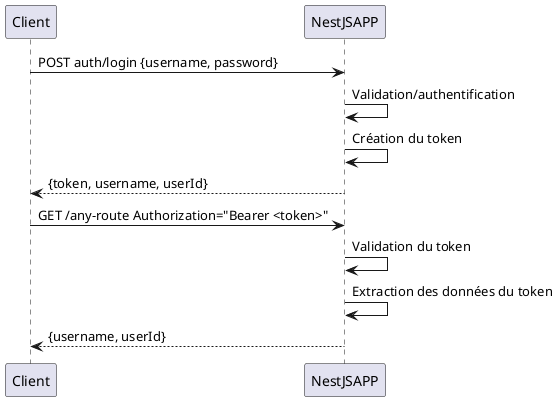
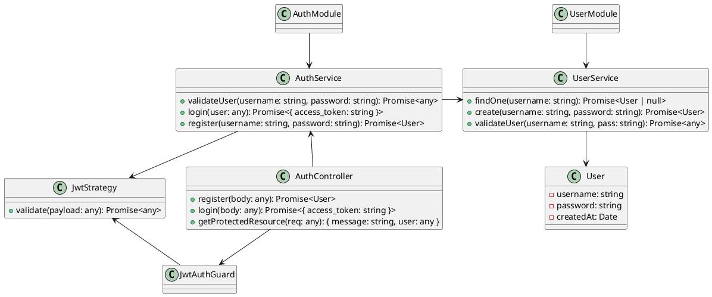
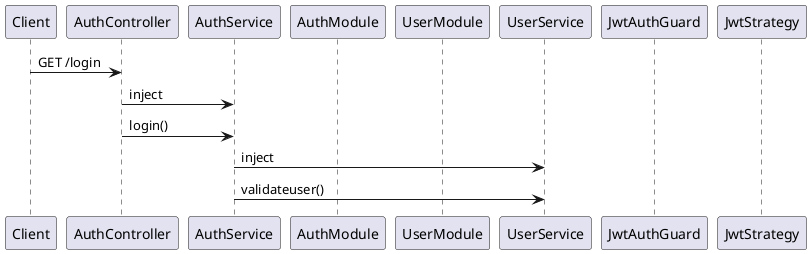
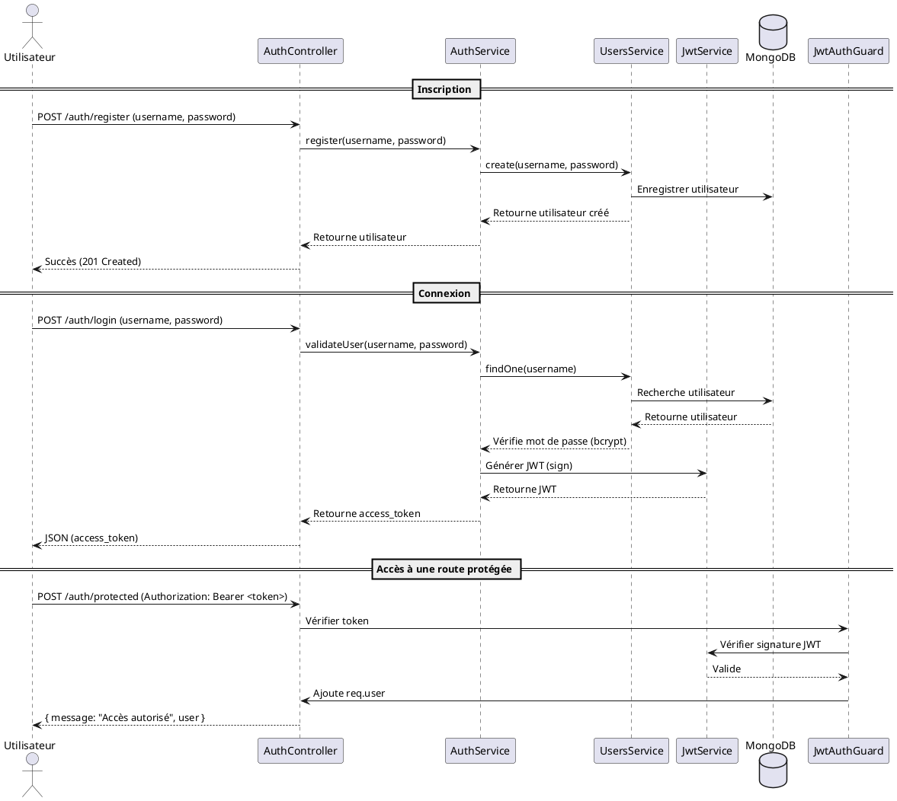

# La sécurité

## Clef d'API

Une des façons les plus simples de sécuriser l'accès à une API reste d'utiliser une clé qui sera transmise et testée avec chaque requête.

### Les Guards

Pour déclencher automatiquement le test de l'autorisation, nous utiliserons le système de `Guard` proposé par NestJS. 

- Un `Guard` est un mécanisme de protection permettant d’autoriser ou de refuser l’accès à une route en fonction de certaines conditions.

- Un `Guard` est exécuté avant qu'un contrôleur ou un gestionnaire de requêtes soit appelé. Il sert principalement à gérer l'authentification et l’autorisation.

- Un `Guard` implémente l'interface `CanActivate` et doit retourner un booléen.

- Un `Guard` accède au contexte d'éxécution de la requête.

Nous pouvons demander à NestJS la génération d'une classe guard comme ceci :

```shell
nest generate guard api-key
```

Modifions ensuite le code de la classe générée pour :

- Renommer le dossier `api-key` en `guards`.
- Injecter `ConfigService` afin de récupérer la clef d'API.
- Comparer la clef transmise avec celle de l'environnement et lever une exception si les deux diffèrent.

>pour le dev, il faudra ajouter `API_KEY` dans notre fichier `.env`).

```typescript
// guards/api-key.guard.ts

import { CanActivate, ExecutionContext, Injectable, UnauthorizedException } from '@nestjs/common';
import { Observable } from 'rxjs';
import { ConfigService } from '@nestjs/config';

@Injectable()
export class ApiKeyGuard implements CanActivate
{

  constructor(
    // Injection de ConfigService
    // pour récupérer la clef d'API
    // dans les variables d'environnement
    private readonly configService: ConfigService
  ) {}

  canActivate(
    context: ExecutionContext,
  ): boolean | Promise<boolean> | Observable<boolean>
  {
    // Conversion du contexte d'exécution en contexte http
    // pour pouvoir lire les en-têtes
    const request = context.switchToHttp().getRequest();

    // Lecture de l'en-tête http
    const apiKey = request.headers['x-api-key'];

    // comparaison de la clef d'API transmise
    // avec la requête avec celle de l'environnement
    if (
          !apiKey 
          || apiKey !== this.configService.get<string>('API_KEY')
        ) 
    {
      throw new UnauthorizedException(
        'Clef API invalide'
      );
    }

    // Si Aucune exception, autorisation de l'accès
    return true;
  }
}
```

Le fichier `.env`, attention, il faut relancer le serveur après toute modification de l'environnement.

```
// .env

PORT=3000
MONGO_URI=mongodb://localhost:27025/formation
API_KEY=123
```

### Utilisation d'un `Guard`

#### Dans un contrôleur

Pour ne protéger que quelques routes de notre application, nous pouvons agir directement dans les méthodes du contrôleur.

```typescript
import { Controller, Get, UseGuards } from '@nestjs/common';
import { ApiKeyGuard } from './guards/api-key.guard';

@Controller('protected')
export class ProtectedController {
  @Get()
  @UseGuards(ApiKeyGuard)
  securedRoute() {
    return { message: 'Route protégée' };
  }
}
```

Nous pouvons également protéger toutes les routes d'un contrôleur. Pour cela, il suffit de décorer la classe avec `@UseGuard`.

```typescript
@UseGuards(ApiKeyGuard)
@Controller('protected')
export class ProtectedController {
  @Get()
  getProtectedData() {
    return { message: 'Route protégée' };
  }
}
```
<!--

Ne fonctionne pas car impossible d'injecter ConfigService

#### De façon globale

Pour appliquer un `Guard` à toute l'application, c'est `main.ts` qu'il faudra modifier.

```typescript
// main.ts

import { NestFactory } from '@nestjs/core';
import { AppModule } from './app.module';
import { ApiKeyGuard } from './guards/api-key.guard';

async function bootstrap() {
  const app = await NestFactory.create(AppModule);
  
  // Applique le Guard à toute l'application
  app.useGlobalGuards(new ApiKeyGuard()); 

  await app.listen(3000);
}
bootstrap();
```
-->
### Exercice

Sécuriser les routes de `BookController` avec une clef d'API.

**Variante :**
Une collection users pourrait stoker des clefs d'API différentes selon les utilisateurs.


## Authentification par token

L'authentification par token est une méthode d'authentification où un utilisateur reçoit un jeton (token) après s’être authentifié une première fois avec ses identifiants. Ce token est ensuite utilisé pour prouver son identité lors des requêtes suivantes, sans avoir à ressaisir ses identifiants à chaque fois.

### Principe de fonctionnement

1. **Connexion initiale**

   - L'utilisateur envoie ses identifiants (email/mot de passe, clé API, etc.) au serveur.
   - Le serveur vérifie ces informations.
   - Si elles sont valides, il génère un token (souvent sous la forme d’une chaîne encodée en JWT ou un UUID).
   - Ce token est renvoyé à l'utilisateur. 

2. **Utilisation du token**

   - Lors des requêtes suivantes, l'utilisateur envoie le token 
        - souvent dans l’en-tête HTTP `Authorization: Bearer <token>`.

   - Le serveur vérifie la validité du token avant d’accorder l'accès aux ressources demandées.

3. **Expiration et renouvellement**

- Les tokens peuvent expirer après un certain temps pour des raisons de sécurité.
- Certains systèmes implémentent un refresh token, qui permet d’obtenir un nouveau token sans se reconnecter.



### JWT (Json Web Token)

JWT (JSON Web Token) est un format standard pour représenter des informations sous forme d'un token sécurisé, utilisé principalement pour l'authentification et l'autorisation des utilisateurs.

Un JWT est une chaîne de caractères encodée qui contient des informations permettant de vérifier l'identité d'un utilisateur. Il est couramment utilisé pour sécuriser les API REST.

Un token JWT est composé de trois parties séparées par des points.

- Un en-tête qui contient des informations sur le type de token et l'algorithme de signature.
- Un payload (charge utile), qui contient les données du token
- Une signature qui permet de vérifier que le token n'a pas été modifié depuis sa création.

```
---------------------------------------
| JWT Token Structure                 |
---------------------------------------
| HEADER (Encodé en Base64)           |
| {                                   |
|   "alg": "HS256",                   |
|   "typ": "JWT"                      |
| }                                   |
---------------------------------------
| PAYLOAD (Encodé en Base64)          |
| {                                   |
|   "userId": "12345",                |
|   "name": "John Doe",               |
|   "exp": 1710000000                 |
| }                                   |
---------------------------------------
| SIGNATURE                           |
| HMACSHA256(                         |
|   base64UrlEncode(header) + "." +   |
|   base64UrlEncode(payload),         |
|   SECRET_KEY                        |
| )                                   |
---------------------------------------
```

### Passport

Passport est une librairie d'authentification pour NodeJS extrêmement populaire. C'est parti particularité et qu'elle supporte plus de 500 stratégies d'authentification différentes. La bonne nouvelle est que NestJS peut parfaitement fonctionner avec cette Bibliothèque.

#### Les classes et les dépendances









#### Installation

```shell
npm install @nestjs/passport \
            passport passport-jwt \
            @nestjs/jwt \
            jsonwebtoken
```

#### Création des modules

```shell
nest generate module auth
```

```shell
nest generate module user
```

#### Le module user

```typescript
// user/user.schema.ts

import { Prop, Schema, SchemaFactory } from '@nestjs/mongoose';
import { Document } from 'mongoose';

export type UserDocument = User & Document;

@Schema()
export class User {
  @Prop({ required: true, unique: true })
  username: string;

  @Prop({ required: true })
  password: string; // Stocké hashé !

}

export const UserSchema = SchemaFactory.createForClass(User);
```

```typescript
import { Injectable } from '@nestjs/common';
import { InjectModel } from '@nestjs/mongoose';
import { Model } from 'mongoose';
import * as bcrypt from 'bcrypt';
import { User, UserDocument } from './schemas/user.schema';

@Injectable()
export class UsersService {
  constructor(
    @InjectModel(User.name) private userModel: Model<UserDocument>
  ) {}

  async findOne(
    username: string
  ): Promise<User | null> 
  {
    return this.userModel
            .findOne({ username })
            .exec();
  }

  async create(
        username: string
        , password: string
  ): Promise<User> 
  {
    const hashedPassword = await bcrypt
                           .hash(password, 10);
                           
    const newUser = new this.userModel(
        { username, password: hashedPassword }
    );
    
    return newUser.save();
  }

  async validateUser(
    username: string, 
    pass: string
  ): Promise<any> 
  {
    const user = await this.findOne(username);
    
    if (user && 
        (await bcrypt.compare(pass, user.password))
    ) 
    {
      const { password, ...result } = user.toObject();
      return result;
    }
    return null;
  }
}
```

```typescript
// user/user.module.ts

import { Module } from '@nestjs/common';
import { MongooseModule } from '@nestjs/mongoose';
import { UsersService } from './user.service';
import { User, UserSchema } from './user.schema';

@Module({
  imports: [
    MongooseModule.forFeature([
        { name: User.name, schema: UserSchema }
    ])
  ],
  providers: [UserService],
  exports: [UserService],
})
export class UsersModule {}
```

#### Le module auth

```typescript
// auth/auth.service.ts

import { Injectable } from '@nestjs/common';
import { JwtService } from '@nestjs/jwt';
import { UserService } from '../user/user.service';

@Injectable()
export class AuthService {
  constructor(
    private readonly userService: UsersService,
    private readonly jwtService: JwtService
  ) {}

  async validateUser(
    username: string, 
    pass: string
  ): Promise<any> 
  {
    return this.usersService
               .validateUser(username, pass);
  }

  async login(user: any) 
  {
    const payload = { 
        username: user.username, sub: user._id 
    };
    return {
      access_token: this.jwtService.sign(payload),
    };
  }

  async register(
    username: string, password: string) 
  {
    return this.usersService.create(username, password);
  }
}
```

```typescript
// auth/auth.controller.ts

import { Controller, Post, Body, 
         Request, UseGuards 
} from '@nestjs/common';
import { AuthService } from './auth.service';
import { JwtAuthGuard } from './jwt-auth.guard';

@Controller('auth')
export class AuthController {
  constructor(
    private readonly authService: AuthService
  ) {}

  @Post('register')
  async register(@Body() body) {
    return this.authService
               .register(body.username, body.password);
  }

  @Post('login')
  async login(@Body() body) {
    return this.authService.login(body);
  }

  @Post('protected')
  @UseGuards(JwtAuthGuard)
  getProtectedResource(@Request() req) {
    return { 
        message: 'Vous avez accès !', 
        user: req.user 
    };
  }
}

```

```typescript
// auth/auth.module.ts

import { Module } from '@nestjs/common';
import { AuthService } from './auth.service';
import { JwtModule } from '@nestjs/jwt';
import { PassportModule } from '@nestjs/passport';
import { JwtStrategy } from './jwt.strategy';
import { ConfigService } from '@nestjs/config';

@Module({
  imports: [
    PassportModule.register({ defaultStrategy: 'jwt' }),
    JwtModule.register({
      secret: configService.get<string>('JWT_SECRET'),
      // Durée de validité du token 
      signOptions: { expiresIn: '1h' }, 
    }),
  ],
  providers: [AuthService, JwtStrategy],
  exports: [AuthService],
})
export class AuthModule {}
```

#### La stratégie

```typescript
// auth/jwt.strategy.ts


import { Injectable } from '@nestjs/common';
import { PassportStrategy } from '@nestjs/passport';
import { ExtractJwt, Strategy } from 'passport-jwt';
import { ConfigService } from '@nestjs/config';

@Injectable()
export class JwtStrategy extends PassportStrategy(Strategy) {
  constructor(configService: ConfigService) {
    super({
      jwtFromRequest: ExtractJwt.fromAuthHeaderAsBearerToken(),
      ignoreExpiration: false,
      secretOrKey: configService.get<string>('JWT_SECRET'),
    });
  }

  async validate(payload: any) {
    return { userId: payload.sub, email: payload.email };
  }
}
```

```typescript
// auth/jwt-auth-guard.ts

import { Injectable } from '@nestjs/common';
import { AuthGuard } from '@nestjs/passport';

@Injectable()
export class JwtAuthGuard extends AuthGuard('jwt') {}
```

## Autorisation